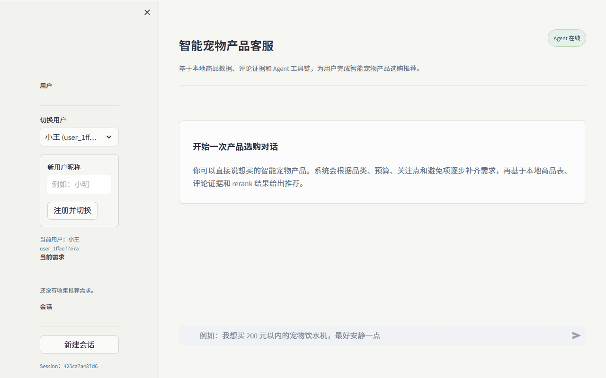
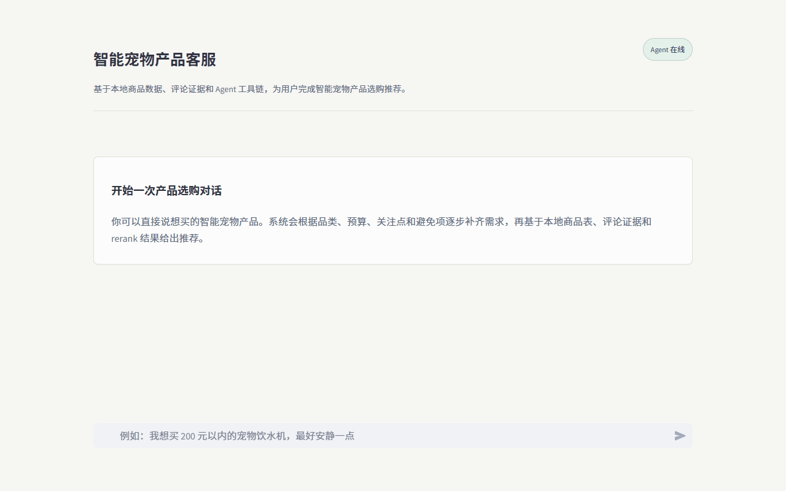
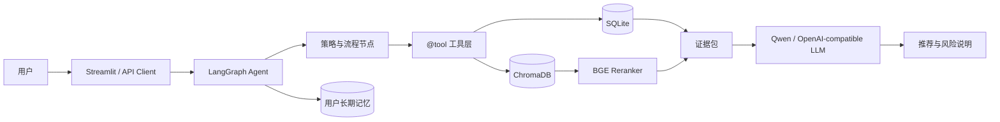
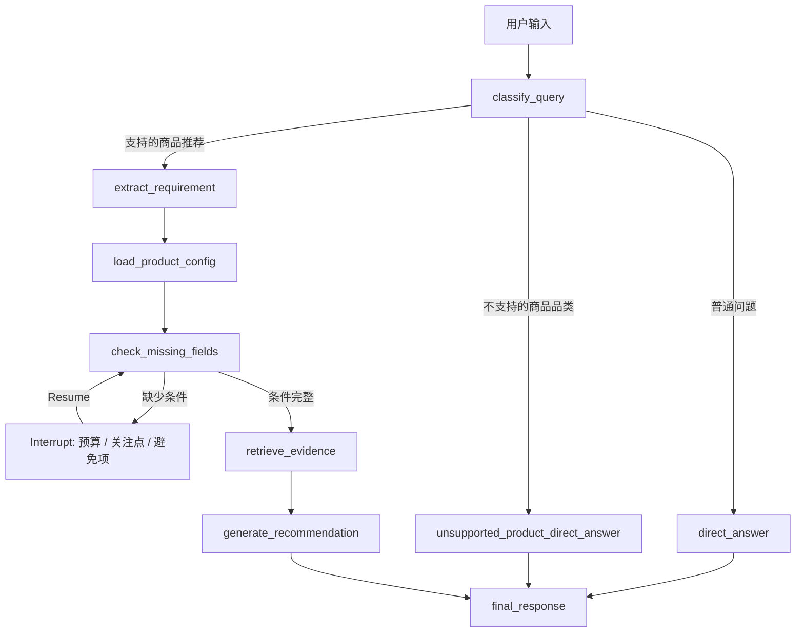

# 智能宠物产品购买决策 Agent

基于淘宝商品与评论历史快照，为智能宠物用品消费者提供有证据的购买建议。系统将用户自然语言需求转为结构化条件，通过 SQLite 筛选候选商品，再使用 ChromaDB、规则重排和 BGE Reranker 检索评论证据，最终由大模型生成主推荐、候选对比与风险说明。

> 本项目是面向作品集与工程实践的 AI Agent 项目，不是淘宝官方服务。价格、销量和评论均为历史数据，不代表实时库存与交易状态。

## 项目演示

### 完整多轮选购与长期记忆

从品类识别开始，依次补全预算、关注点和避免项，完成推荐后确认购买，并在新会话中读取长期记忆。



### 完整条件快速推荐

用户一次提供完整条件，Agent 直接进入商品筛选、评论检索与推荐生成。



## 产品规划摘要

**产品定位**：面向智能宠物用品消费者的购买决策 Agent。它不只是按价格或销量排序，而是通过对话理解品类、预算、关注点和避免项，再基于商品事实与真实评论证据给出可解释建议。

**目标用户**：有购买需求，但不了解产品差异、合理价格和常见问题的消费者。用户可以直接使用自然语言，不需要预先掌握复杂参数。

**核心问题**：

- 用户只知道想购买某类智能宠物产品，但预算、关注点和避免项并不完整。
- 商品数量多，仅靠价格或销量难以解释为什么推荐。
- 评论文本冗长，优点与问题证据难以快速比较。
- 多轮对话需要隔离用户、会话和已确认的购买记忆。

**数据样本**：完整原始数据不公开。仓库提供 [脱敏样本](data/sample/README.md)，展示商品、评论、标签证据与标签统计四类数据结构；真实数据经过去重、异常处理及规则标签证据聚合后用于本地运行。

**支持范围**：智能宠物喂食器、饮水机、猫砂盆、摄像头、项圈和逗猫器六类商品。信息不足时按需补充条件，用户也可以跳过可选项。

**业务流程**：确认品类与已有条件 → 读取品类价格和高频标签 → 补全缺失项 → 筛选候选商品 → 检索对应商品评论 → 输出主推荐、候选对比、评论证据与风险。

**产品边界**：只提供售前选购参考，不处理库存、下单、支付、订单、物流、退款、售后或宠物医疗问题。预算内无结果时返回历史价格参考，不越过用户预算强行推荐。

## 核心能力

- **模型语义理解**：识别普通问答、支持品类推荐和不支持品类咨询。
- **渐进式需求补全**：按需确认预算、关注点与避免项，使用 LangGraph Interrupt/Resume 恢复同一任务。
- **混合检索**：SQLite 精确筛选候选商品，ChromaDB 语义召回评论，BGE Reranker 精排证据。
- **证据化推荐**：输出首推商品、候选对比、评论证据和数据风险，不让无证据商品成为首推。
- **用户隔离与长期记忆**：使用 `user_id + session_id` 隔离会话；购买记录仅在用户明确确认后写入，保留最近 10 条。
- **可观测性**：节点日志和 LangSmith Trace 用于检查 Graph 路径、状态变化与节点耗时。
- **双交付入口**：Streamlit 用于交互演示，FastAPI 提供稳定 JSON 契约。

## 系统架构



Agent 主流程：



## 数据与检索设计

### 数据来源与分层

影刀 RPA 从淘宝公开商品页和评论页采集六类商品，保存为历史快照。数据由项目维护者离线更新，不代表实时价格、库存、销量或促销。

```text
data/raw        原始商品与评论 CSV
    -> 清洗、价格与销量标准化、去重、标签匹配、证据提取
data/processed  评论标签证据表与商品标签统计表
    -> 导入与向量化
data/runtime    SQLite、ChromaDB 和内容哈希
```

`review_tag_evidence.csv` 保存“评论命中了哪个标签、属于优势/问题/混合/提及中的哪种证据，以及对应评论原文”，用于证据追溯、前端展示和向量索引。

`product_tag_stats.csv` 按“商品 + 标签”聚合证据，核心指标为：

- `confidence = min(1, log(1 + mention_count) / log(21))`：衡量证据充分程度，提及达到 20 条后记为 1。
- `smoothed_advantage_rate = (advantage_count + prior_advantage_rate × 10) / (mention_count + 10)`：优势率经过贝叶斯平滑；`prior_advantage_rate` 为同品类、同标签在全量评论中的优势率，`10` 为先验样本量。
- `smoothed_problem_rate = (problem_count + prior_problem_rate × 10) / (mention_count + 10)`：问题率使用同样的平滑方式；`prior_problem_rate` 为同品类、同标签在全量评论中的问题率。
- `advantage_support = smoothed_advantage_rate × confidence`：先验平滑后的优势支持强度，防止少量好评产生虚高分。
- `problem_pressure = smoothed_problem_rate × confidence`：先验平滑后的问题压力，限制少量负面评论造成的极端影响。

### 存储职责

- **SQLite**：结构化事实来源，负责品类、预算、商品 ID、销量、价格、标签统计的精确过滤、关联和排序。
- **ChromaDB**：可重建的语义索引，只在候选商品范围内召回与用户关注点语义相关的评论。
- **BGE Reranker**：比较用户需求与召回评论，对规则筛选后的证据进行精排。

不能只使用向量库，因为预算和价格需要确定性数值约束；也不能只使用 SQLite 或关键词，因为用户表达与评论原文可能语义相同但用词不同。

### 在线检索链路

```text
结构化需求
  -> SQLite 按品类和预算筛选初始候选
  -> 结合标签支持度、问题压力、销量归一化和价格适配计算推荐分
  -> 选出 Top 3 候选商品
  -> ChromaDB 按商品 ID 为每个候选召回评论 Top 20
  -> 规则混合重排、文本去重并保留候选商品覆盖
  -> BGE Reranker 精排最终评论证据
  -> 模型仅基于候选商品、标签统计和最终证据生成回答
```

评论证据必须属于对应候选商品。SQLite、ChromaDB、嵌入模型或 BGE 不可用时明确返回检索失败，不允许模型补写不存在的评论；结构化事实与向量索引不一致时停止生成。

## 目录结构

```text
app/                         Streamlit 展示层
assets/                      GitHub README 演示 GIF
config/                      Agent、模型、Chroma 与重排配置
data/                        私有原始数据、处理结果和运行时数据
scripts/core/                离线数据管线和模型下载入口
src/pet_agent/agent/         Graph、State、节点、工具和提示词
src/pet_agent/api/           FastAPI 请求与响应契约
src/pet_agent/memory/        用户长期记忆策略
src/pet_agent/retrieval/     规则重排、去重和 BGE 精排
src/pet_agent/storage/       SQLite、ChromaDB 与内容哈希存储
tests/                       单元测试和集成测试
```

## 本地运行

### 1. 环境准备

- Python 3.10 或 3.11
- 可用的 DashScope/Qwen 或 OpenAI-compatible API Key
- 建议至少 8 GB 内存；加载本地 BGE 时建议 16 GB

```powershell
git clone <your-repository-url>
cd Smart_Pet_Product_Recommend_System
python -m venv .venv
.\.venv\Scripts\Activate.ps1
python -m pip install --upgrade pip
pip install -e ".[dev]"
Copy-Item .env.example .env
```

编辑 `.env`，至少填写当前模型提供方对应的 API Key。不要提交 `.env`。

### 2. 准备数据

公开仓库不包含淘宝原始商品、评论和由评论生成的证据文件。将本地数据放入：

```text
data/raw/raw_products.csv
data/raw/raw_reviews.csv
```

然后构建 SQLite 与 ChromaDB：

```powershell
python scripts/core/run_local_pipeline.py
```

### 3. 下载 BGE Reranker

```powershell
python scripts/core/download_reranker_model.py
```

模型默认保存到 `models/rerank/bge-reranker-base`，该目录不会提交到 Git。

### 4. 启动演示界面

```powershell
streamlit run app/streamlit_app.py --server.port 8501
```

访问 `http://127.0.0.1:8501`。

### 5. 启动 FastAPI

```powershell
python -m uvicorn pet_agent.api.main:app --app-dir src --host 127.0.0.1 --port 8000
```

- Swagger：`http://127.0.0.1:8000/docs`
- 接口结构展示：`http://127.0.0.1:8000/api-docs`

在内存有限的本机上，建议 Streamlit 与 FastAPI 只启动一个，因为两个独立进程会各自持有模型对象。

## 测试

测试使用隔离的临时数据和 Fake Embedding，不依赖真实淘宝数据或在线模型：

```powershell
pytest -q
```

当前测试覆盖数据清洗、销量转换、标签分析、Graph 分支、证据策略、重排、内容哈希、API 契约与用户隔离。

## 数据与安全边界

- 数据由影刀 RPA 从淘宝公开页面采集，仅作为历史快照与技术研究样本。
- 公开仓库不包含完整抓取数据、评论证据、用户记忆和运行时数据库。
- 系统只提供售前选购参考，不处理库存、下单、订单、物流、售后或医疗问题。
- 推荐结果不能替代商品详情页、平台规则或专业意见。
- API 当前没有生产级认证、限流和持久化 Checkpoint，不应直接暴露到公网。

## 当前状态

这是一个可运行的工程化 MVP，重点展示 Agent 编排、结构化与语义混合检索、证据约束、Interrupt/Resume、用户隔离和长期记忆。正式生产化仍需补齐认证授权、持久化 Checkpoint、任务队列、限流、监控告警和自动化评测集。
